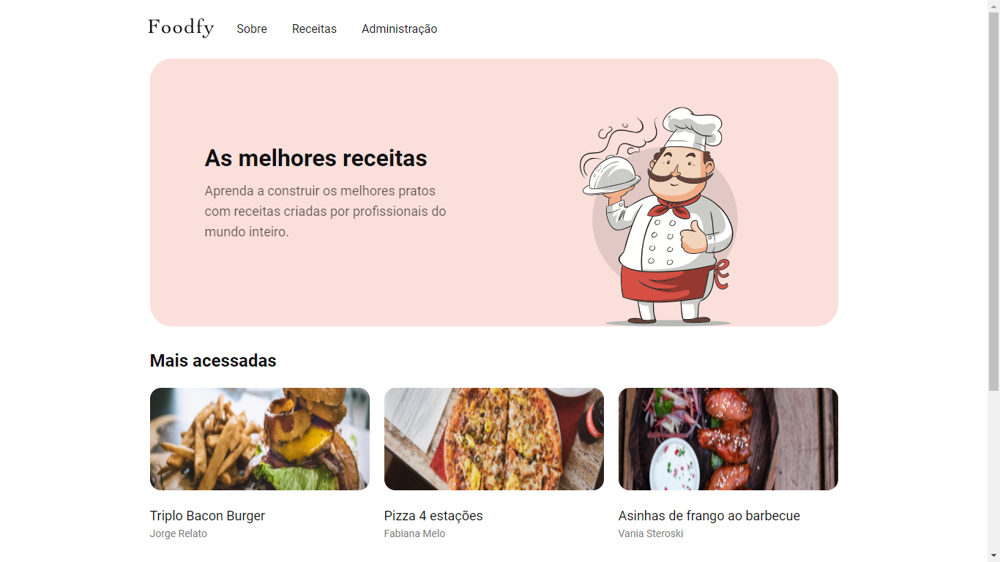
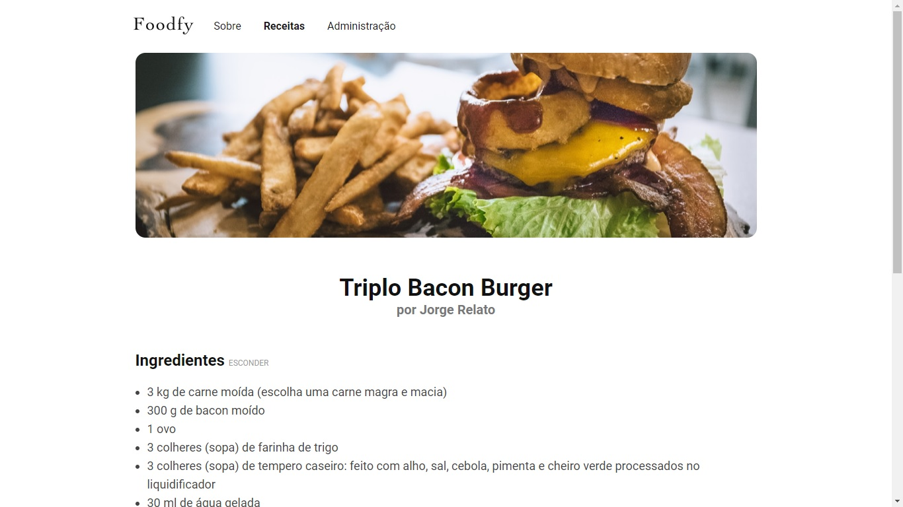
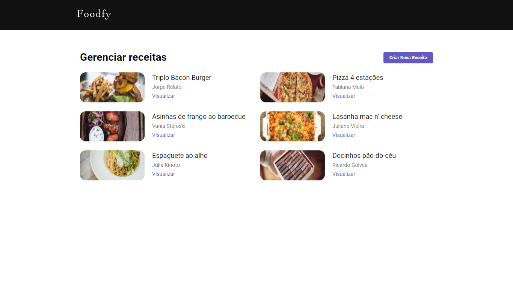

<h1 align="center">
     
        
      
        Foodfy 
</h1>

    

        Application to manage recipes and chefs. Made with Express, Nunjucks, CSS and PostGres.
    

    
    
     
    

  

    
    
    
  

## Features

- 👩‍🍳 Find amazing chefs and mouth-watering recipes 🍤
- 💻 Through an administrative platform, manage chefs and their recipes 🍴 

## Explored and implemented concepts

- [X] MVC Model
- [X] Individual pages for each recipe and chef
- [X] Database creation
- [X] Creation and connection to the database
- [ ] Applying CRUD for chefs and recipes
- [ ] Relationships between tables
- [ ] Search filters
## Getting started

Coming soon

<!-- As this is an introductory project, there is no installation tutorial. Just open and enjoy. -->

## License

Released in 2020. This project is under the MIT license.
Made with care and love by Yuri Oliveira 🚀.
